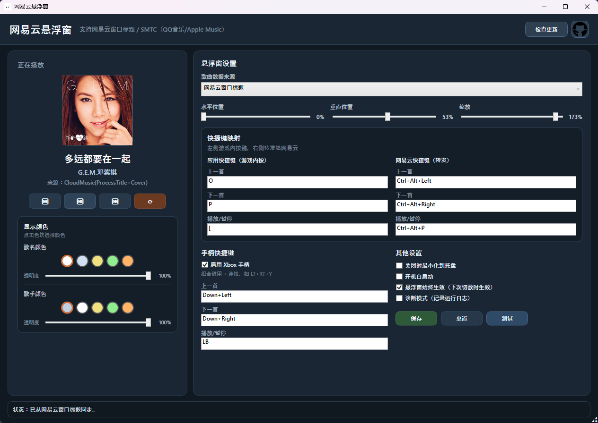

# 网易云悬浮窗 v1.6.0

一个 Windows 桌面工具：游戏中自定义快捷键转发网易云切歌，并显示透明悬浮窗（封面 + 歌名 + 歌手）。

支持**键盘**和 **Xbox 手柄**快捷键。

## 截图




## 功能

- **透明悬浮窗**：点击穿透、置顶、不抢焦点、全屏任意位置
- **双数据源**：网易云窗口标题检测 / SMTC 系统媒体会话（QQ音乐、Apple Music 等）
- **封面显示**：从网易云本地数据匹配下载并缓存，支持漫游模式
- **歌名/歌手颜色自定义**：5 种预设色块 + 透明度滑块
- **悬浮窗始终显示**：切歌时淡入淡出交叉过渡，不中断显示
- **键盘快捷键映射**：自定义应用快捷键 → 转发网易云快捷键
- **Xbox 手柄快捷键**：支持组合键（如 `LB+Left`），独立开关
- **悬浮窗自定义**：水平/垂直位置（0-100%）、缩放，可保存
- **设置持久化**：保存在 `%LOCALAPPDATA%\HorizonRadioOverlay\overlay-settings.json`
- **淡入淡出动画**：歌曲切换时自动弹出和隐藏
- **托盘最小化**：关闭时最小化到系统托盘，双击恢复
- **开机自启**：注册表方式，`--autostart` 最小化启动
- **检查更新**：自动检测 GitHub Releases 新版本
- **实时歌词**：网易云 API 获取歌词，随播放进度实时更新
- **Cover Flow 模式**：3D 封面轮播效果（设置中开启）

## 下载

前往 [Releases](https://github.com/xw66/Cloud-Music-overlay-for-Forza-Horizon/releases) 下载最新版本。

提供三个架构：
- `win-x64`：绝大多数 PC 选择此版本
- `win-x86`：32 位系统
- `win-arm64`：ARM 设备（如 Surface Pro X）

自包含单文件 exe，免安装 .NET 运行时。

### 运行方法

**方法一：直接运行**
1. 下载 exe 文件
2. 右键点击 exe → 属性 → 勾选"解除锁定" → 确定
3. 双击运行

**方法二：SmartScreen 提示时**
1. 下载 exe 文件
2. 双击运行，会弹出 "Windows 已保护你的电脑" 提示
3. 点击 "更多信息"
4. 点击 "仍要运行"

**方法三：右键运行**
1. 下载 exe 文件
2. 右键点击 exe → 以管理员身份运行

> 本程序未购买代码签名证书，所以 Windows 会显示安全警告。程序本身是安全的，源代码完全开源。

## 运行环境

- Windows 10 / 11
- 网易云音乐桌面版（进程名：`cloudmusic`）
- （手柄功能）Xbox 兼容手柄

## 使用说明

### 第一步：设置网易云快捷键

在网易云音乐中设置你想要的全局快捷键（如 `Ctrl+Alt+Left` 上一首、`Ctrl+Alt+Right` 下一首、`Ctrl+Alt+P` 播放/暂停）。

### 第二步：打开本工具

- **数据来源**：选择"网易云窗口标题"或"QQ音乐 / Apple Music 等（SMTC）"
- **快捷键映射**：左侧填写游戏中按的键，右侧填写网易云快捷键
- **显示颜色**：点击色块选择歌名/歌手颜色，拖动滑块调整透明度

### 第三步：启动游戏

悬浮窗会在歌曲切换时自动弹出，5 秒后淡出。勾选"悬浮窗始终生效"可保持常驻。

## 快捷键说明

| 类型 | 示例 | 说明 |
|------|------|------|
| 键盘单键 | `L` | 单个字母或符号键 |
| 键盘组合 | `Ctrl+Shift+Left` | 修饰键 + 按键 |
| 手柄组合 | `LB+Left` | 按键用 `+` 连接 |
| 手柄特殊 | `LT+RT+Y` | 支持同时按多个键 |

## 开发运行

```powershell
dotnet run
```

## 打包发布

```powershell
dotnet publish -c Release -r win-x64 --self-contained true -p:PublishSingleFile=true
```

输出在 `publish` 目录，文件名带版本号后缀。

## 常见问题

**保存后不生效？**
确认状态栏提示"已保存并应用"。若提示注册失败，说明应用快捷键被其他程序占用，换一组即可。

**悬浮窗不显示？**
确认网易云正在播放歌曲，且进程名为 `cloudmusic`。SMTC 模式需先播放任意媒体内容。

**手柄不能用？**
确认手柄已连接，"启用 Xbox 手柄快捷键"已勾选并保存。

**悬浮窗位置/颜色不生效？**
点击"保存"按钮持久化设置，或勾选对应选项即时生效。

## 技术栈

- .NET 8.0 WPF
- SMTC（Windows.Media.Control）
- XInput（Xbox 手柄支持）
- Win32 API（全局热键、窗口枚举、快捷键转发）

## 许可证

MIT
