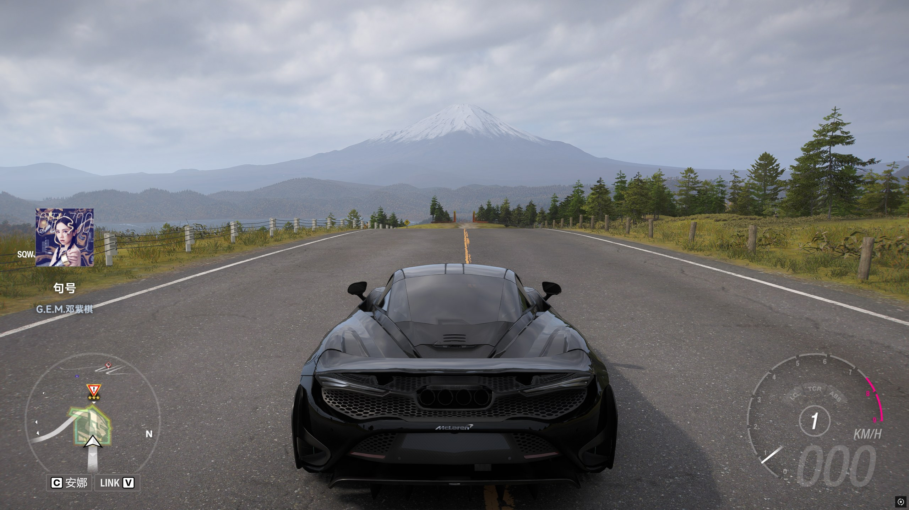

# 网易云悬浮窗 v1.9.1

一个 Windows 桌面工具：游戏中自定义快捷键转发网易云切歌，并显示透明悬浮窗（封面 + 歌名 + 歌手）。

支持 **键盘** 和 **Xbox 手柄** 快捷键。

## 截图




## 功能

- **透明悬浮窗**：点击穿透、置顶、不抢焦点、全屏任意位置，并增强了对部分游戏窗口遮挡的兼容性
- **双数据源**：
  - **网易云窗口标题**：专门给网易云音乐使用
  - **SMTC 系统媒体会话**：用于 QQ 音乐、Apple Music 等支持系统媒体会话的播放器
- **网易云封面适配**：优先从网易云本地播放数据定位当前歌曲，再从网易云官方接口获取并缓存封面
- **歌名/歌手颜色自定义**：5 种预设色块 + 透明度滑块
- **悬浮窗始终显示**：切歌时淡入淡出交叉过渡，不中断显示
- **键盘快捷键映射**：自定义应用快捷键 -> 转发网易云快捷键
- **Xbox 手柄快捷键**：支持组合键（如 `LB+Left`），独立开关
- **悬浮窗自定义**：水平/垂直位置（0-100%）、缩放，可保存
- **设置持久化**：保存在 `%LOCALAPPDATA%\HorizonRadioOverlay\overlay-settings.json`
- **淡入淡出动画**：歌曲切换时自动弹出和隐藏
- **托盘最小化**：关闭时最小化到系统托盘，双击恢复
- **开机自启**：注册表方式，`--autostart` 最小化启动
- **检查更新**：自动检测 GitHub Releases 新版本
- **实时歌词**：
  - `网易云窗口标题`：支持歌词显示，按软件自身播放计时匹配歌词时间轴
  - `SMTC`：按系统媒体会话提供的歌名 / 歌手 / 时间轴进行查词与同步
- **Cover Flow 模式**：3D 封面轮播效果（设置中开启）

## 下载

前往 [Releases](https://github.com/xw66/Cloud-Music-overlay-for-Forza-Horizon/releases) 下载最新版本。

提供三个架构：
- `win-x64`：绝大多数 PC 选择此版本
- `win-x86`：32 位系统
- `win-arm64`：ARM 设备（如 Surface Pro X）

发布包为**自包含单文件版**，免安装 .NET 运行时。

### 运行方法

**方法一：直接运行**
1. 下载 `HorizonRadioOverlay.exe`
2. 右键点击 `HorizonRadioOverlay.exe` -> 属性 -> 勾选“解除锁定” -> 确定
3. 双击运行

**方法二：SmartScreen 提示时**
1. 双击 `HorizonRadioOverlay.exe`
2. 出现“Windows 已保护你的电脑”提示
3. 点击“更多信息”
4. 点击“仍要运行”

**方法三：右键运行**
1. 右键点击 `HorizonRadioOverlay.exe`
2. 选择“以管理员身份运行”

> 本程序未购买代码签名证书，所以 Windows 会显示安全警告。程序本身是安全的，源代码完全开源。

## 运行环境

- Windows 10 1809（10.0.17763）及以上 / Windows 11
- 网易云音乐桌面版（仅网易云专用渠道需要，进程名：`cloudmusic`）
- （手柄功能）Xbox 兼容手柄

> 说明 1：`SMTC` 模式依赖较新的 Windows 媒体会话能力。低于 Windows 10 1809 的环境会自动回退为网易云窗口标题模式。
>
> 说明 2：两个渠道是完全分开的业务：
> - **网易云窗口标题**：只给网易云使用，专门适配网易云封面、快捷键转发和歌词显示
> - **SMTC**：只对接 Windows `SMTC` 媒体会话，不针对某个播放器单独做业务适配

## 使用说明

### 第一步：设置网易云快捷键

在网易云音乐中设置你想要的全局快捷键（如 `Ctrl+Alt+Left` 上一首、`Ctrl+Alt+Right` 下一首、`Ctrl+Alt+P` 播放/暂停）。

### 第二步：打开本工具

- **数据来源**：
  - 选择 **网易云窗口标题**：仅用于网易云音乐
  - 选择 **SMTC**：用于 QQ 音乐、Apple Music 等支持系统媒体会话的播放器
- **快捷键映射**：左侧填写游戏中按的键，右侧填写网易云快捷键
- **显示颜色**：点击色块选择歌名/歌手颜色，拖动滑块调整透明度
- **歌词说明**：
  - `网易云窗口标题`：歌词按软件自身计时同步，不跟随网易云客户端内的 seek / 拖动进度
  - `SMTC`：歌词滚动同步依赖 `SMTC` 时间轴

### 第三步：启动游戏

悬浮窗会在歌曲切换时自动弹出，5 秒后淡出。勾选“悬浮窗始终生效”可保持常驻。

## 快捷键说明

| 类型 | 示例 | 说明 |
|------|------|------|
| 键盘单键 | `L` | 单个字母或符号键 |
| 键盘组合 | `Ctrl+Shift+Left` | 修饰键 + 按键 |
| 手柄组合 | `LB+Left` | 按键用 `+` 连接 |
| 手柄特殊 | `LT+RT+Y` | 支持同时按多个键 |

## 开发运行

```powershell
dotnet run
```

## 打包发布

```powershell
dotnet publish -c Release -r win-x64 --self-contained true -p:PublishSingleFile=true -p:DebugSymbols=false -p:DebugType=None -o .\publish\HorizonRadioOverlay_v1.9.1
```

发布结果在 `publish\HorizonRadioOverlay_v1.9.1\HorizonRadioOverlay.exe`。  
默认按单文件分发，直接分发这个 exe 即可。

## 常见问题

**保存后不生效？**  
确认状态栏提示“已保存并应用”。若提示注册失败，说明应用快捷键被其他程序占用，换一组即可。

**悬浮窗不显示？**  
确认当前所选渠道与播放器匹配：
- **网易云窗口标题**：确认网易云正在播放歌曲，且进程名为 `cloudmusic`
- **SMTC**：确认当前播放器已开始播放，并且系统能读到媒体会话

**手柄不能用？**  
确认手柄已连接，“启用 Xbox 手柄快捷键”已勾选并保存。

**悬浮窗位置/颜色不生效？**  
点击“保存”按钮持久化设置，或勾选对应选项即时生效。

**为什么有些歌词不显示？**  
- `网易云窗口标题`：会优先使用网易云本地识别到的 `songId` 取词；如果当前歌曲本身无歌词，或标题 / 本地数据未能稳定对应到正确歌曲，仍可能出现无歌词。
- `SMTC`：歌词依赖播放器提供的 `歌名 / 歌手 / 时间轴`。如果播放器元数据不完整、时间轴异常，或外部歌词源未命中，也可能出现少量歌曲无歌词。

**为什么有些游戏里悬浮窗还是可能被盖住？**  
当前版本已经加强了顶层保持策略，对大多数窗口化全屏、无边框全屏游戏会更稳定；但如果游戏使用真正的独占全屏，桌面悬浮窗仍可能受系统限制而无法压在最上层。

## 技术栈

- .NET 8.0 WPF
- SMTC（Windows.Media.Control）
- XInput（Xbox 手柄支持）
- Win32 API（全局热键、窗口枚举、快捷键转发）

## 许可证

MIT


