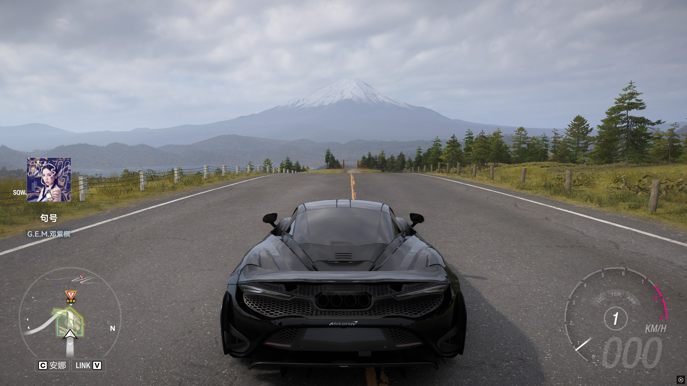
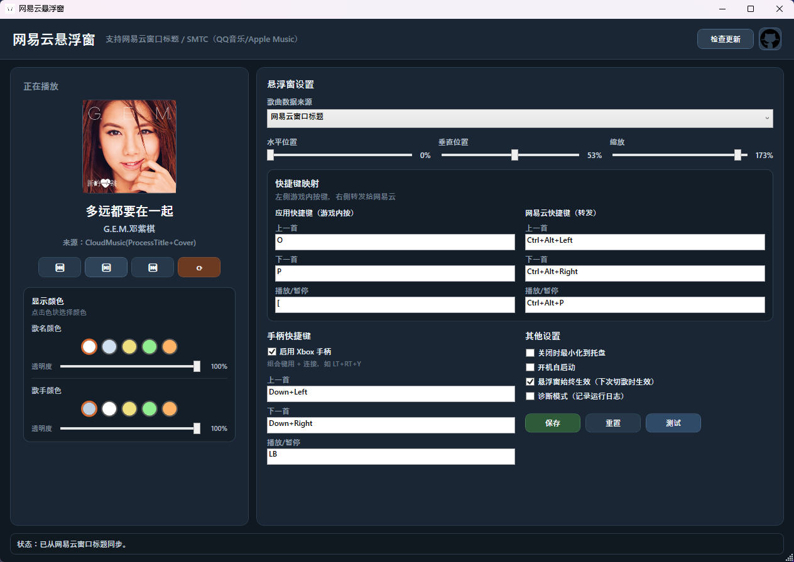

# 网易云悬浮窗 v3.0.1

一个 Windows 桌面工具：游戏中自定义快捷键转发网易云切歌，并显示透明悬浮窗（封面 + 歌名 + 歌手）。

支持 **键盘**、**Xbox 手柄**、**DualSense（DS5）手柄** 和 **方向盘等 HID/DirectInput 外设** 快捷键。

## 截图





## 功能

- **透明悬浮窗**：点击穿透、置顶、不抢焦点、全屏任意位置，并增强了对部分游戏窗口遮挡的兼容性
- **双数据源**：
  - **网易云窗口标题**：专门给网易云音乐使用
  - **SMTC 系统媒体会话**：用于 QQ 音乐、Apple Music 等支持系统媒体会话的播放器
- **网易云封面适配**：优先从网易云本地播放数据定位当前歌曲，再从网易云官方接口获取并缓存封面
- **歌名/歌手颜色自定义**：5 种预设色块 + 透明度滑块
- **悬浮窗始终显示**：切歌时淡入淡出交叉过渡，不中断显示
- **键盘快捷键映射**：自定义应用快捷键 -> 转发网易云快捷键
- **手柄 / 方向盘外设快捷键**：支持组合键（如 `LB+Left`、`L1+Left` 或 `Button1+Button2`），独立开关
- **悬浮窗自定义**：水平/垂直位置（0-100%）、缩放，可保存
- **设置持久化**：保存在 `%LOCALAPPDATA%\HorizonRadioOverlay\overlay-settings.json`
- **淡入淡出动画**：歌曲切换时自动弹出和隐藏
- **托盘最小化**：关闭时最小化到系统托盘，双击恢复
- **开机自启**：注册表方式，`--autostart` 最小化启动
- **检查更新**：自动检测 GitHub Releases 新版本
- **实时歌词**：
  - `网易云窗口标题`：可选只读内存时间轴（实验功能）同步 seek；不可用或关闭时自动退回本地计时
  - `SMTC`：按系统媒体会话提供的歌名 / 歌手 / 时间轴进行查词与同步
- **后台播放快照**：播放器读取与界面刷新解耦，连续失败自动降级和重试
- **Cover Flow 模式**：3D 封面轮播效果（设置中开启）

## 下载

前往 [Releases](https://github.com/xw66/Cloud-Music-overlay-for-Forza-Horizon/releases) 下载最新版本。

更新内容见 [CHANGELOG.md](CHANGELOG.md)。

提供三个架构：
- `win-x64`：绝大多数 PC 选择此版本
- `win-x86`：32 位系统
- `win-arm64`：ARM 设备（如 Surface Pro X）

> 网易云只读内存时间轴仅在 64 位进程中启用；`win-x86` 会自动使用本地歌词计时。

发布包为**自包含单文件版**，免安装 .NET 运行时。

### 运行方法

**方法一：直接运行**
1. 下载 `HorizonRadioOverlay.exe`
2. 右键点击 `HorizonRadioOverlay.exe` -> 属性 -> 勾选“解除锁定” -> 确定
3. 双击运行

**方法二：SmartScreen 提示时**
1. 双击 `HorizonRadioOverlay.exe`
2. 出现“Windows 已保护你的电脑”提示
3. 点击“更多信息”
4. 点击“仍要运行”

**方法三：右键运行**
1. 右键点击 `HorizonRadioOverlay.exe`
2. 选择“以管理员身份运行”

> 本程序未购买代码签名证书，所以 Windows 会显示安全警告。程序本身是安全的，源代码完全开源。

## 运行环境

- Windows 10 1809（10.0.17763）及以上 / Windows 11
- 网易云音乐桌面版（仅网易云专用渠道需要，进程名：`cloudmusic`）
- （手柄功能）Xbox 兼容手柄或 Sony DualSense（DS5）

> 说明 1：`SMTC` 模式依赖较新的 Windows 媒体会话能力。低于 Windows 10 1809 的环境会自动回退为网易云窗口标题模式。
>
> 说明 2：两个渠道是完全分开的业务：
> - **网易云窗口标题**：只给网易云使用，专门适配网易云封面、快捷键转发和歌词显示
> - **SMTC**：只对接 Windows `SMTC` 媒体会话，不针对某个播放器单独做业务适配

## 使用说明

### 第一步：设置网易云快捷键

在网易云音乐中设置你想要的全局快捷键（如 `Ctrl+Alt+Left` 上一首、`Ctrl+Alt+Right` 下一首、`Ctrl+Alt+P` 播放/暂停）。

### 第二步：打开本工具

- **数据来源**：
  - 选择 **网易云窗口标题**：仅用于网易云音乐
  - 选择 **SMTC**：用于 QQ 音乐、Apple Music 等支持系统媒体会话的播放器
- **快捷键映射**：左侧填写游戏中按的键，右侧填写网易云快捷键
- **显示颜色**：点击色块选择歌名/歌手颜色，拖动滑块调整透明度
- **歌词说明**：
  - `网易云窗口标题`：默认启用只读内存时间轴实验功能，可跟随 seek；读取失败时自动降级为本地计时，可在设置中关闭
  - `SMTC`：歌词滚动同步依赖 `SMTC` 时间轴

### 第三步：启动游戏

悬浮窗会在歌曲切换时自动弹出，5 秒后淡出。勾选“悬浮窗始终生效”可保持常驻。

### 直播软件捕获悬浮窗

悬浮窗可作为独立窗口源捕获，无需录制整个桌面。以 OBS Studio 为例：

1. 在“来源”中添加“窗口采集”。
2. 窗口选择 `[HorizonRadioOverlay.exe]: [直播源] 网易云悬浮窗`，不要选择主页面“网易云悬浮窗”。
3. 捕获方式选择“Windows 10（1903 及以上）”或“自动”，不要使用旧版 BitBlt。
4. 窗口匹配优先级选择“窗口标题必须匹配”，开启“客户端区域”，关闭“捕获光标”。

这样会保留悬浮窗的透明背景、阴影、Cover Flow 和淡入淡出效果，其他桌面窗口不会进入画面。直播源窗口会一直供 OBS 绑定，悬浮窗淡出时来源只会变透明，不会回退捕获主页面。

## 快捷键说明

| 类型 | 示例 | 说明 |
|------|------|------|
| 键盘单键 | `L` | 单个字母或符号键 |
| 键盘组合 | `Ctrl+Shift+Left` | 修饰键 + 按键 |
| 手柄组合 | `LB+Left` / `L1+Left` | 按键用 `+` 连接 |
| 手柄特殊 | `LT+RT+Y` / `L2+R2+Triangle` | 支持 Xbox 与 DS5 按键名 |
| 方向盘外设 | `Button1+Button2` | 支持 HID/DirectInput 设备前 16 个物理按钮 |

## 开发运行

```powershell
.\dotnet10.cmd run
```

运行测试：

```powershell
.\dotnet10.cmd test tests\HorizonRadioOverlay.Tests\HorizonRadioOverlay.Tests.csproj -c Release
```

## 打包发布

```powershell
dotnet publish -c Release -r win-x64 --self-contained true -p:PublishSingleFile=true -p:DebugSymbols=false -p:DebugType=None -o .\publish\HorizonRadioOverlay_v3.0.1
```

发布结果在 `publish\HorizonRadioOverlay_v3.0.1\HorizonRadioOverlay.exe`。
默认按单文件分发，直接分发这个 exe 即可。

## 常见问题

**保存后不生效？**  
确认状态栏提示“已保存并应用”。若提示注册失败，说明应用快捷键被其他程序占用，换一组即可。

**悬浮窗不显示？**  
确认当前所选渠道与播放器匹配：
- **网易云窗口标题**：确认网易云正在播放歌曲，且进程名为 `cloudmusic`
- **SMTC**：确认当前播放器已开始播放，并且系统能读到媒体会话

**手柄或方向盘外设不能用？**  
确认设备已通过 USB 或蓝牙连接，“启用手柄 / 方向盘外设”已勾选并保存。方向盘按钮通常会显示为 `Button1` 到 `Button16`。

**悬浮窗位置/颜色不生效？**  
点击“保存”按钮持久化设置，或勾选对应选项即时生效。

**为什么有些歌词不显示？**  
- `网易云窗口标题`：会优先使用网易云本地识别到的 `songId` 取词；如果当前歌曲本身无歌词，或标题 / 本地数据未能稳定对应到正确歌曲，仍可能出现无歌词。
- `SMTC`：歌词依赖播放器提供的 `歌名 / 歌手 / 时间轴`。如果播放器元数据不完整、时间轴异常，或外部歌词源未命中，也可能出现少量歌曲无歌词。

**网易云歌词为什么显示“已降级”？**

只读内存时间轴尚未适配当前网易云版本，或连续读取失败。程序会自动保留歌词并改用本地计时，不会修改网易云进程；也可以在“悬浮窗设置”中关闭该实验功能。

**为什么有些游戏里悬浮窗还是可能被盖住？**  
当前版本已经加强了顶层保持策略，对大多数窗口化全屏、无边框全屏游戏会更稳定；但 DirectX 独占全屏游戏不支持普通桌面悬浮窗置顶。此类游戏会绕过桌面窗口合成，Windows 不允许普通 WPF/Win32 透明窗口覆盖在其画面上方。建议改用窗口化、无边框全屏、窗口化全屏模式，或使用 OBS 等直播软件捕获悬浮窗窗口源。

## 技术栈

- .NET 10.0 WPF
- SMTC（Windows.Media.Control）
- XInput + Windows.Gaming.Input（Xbox / DS5 手柄支持）
- Win32 API（全局热键、窗口枚举、快捷键转发）

## 许可证

MIT


